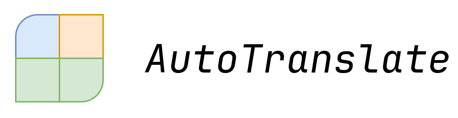

# AI应用类 / AutoTranslate for Mediawiki / demo（beta版）

借助AI的能力，自动化 翻译Mediawiki条目的流程。

## 重要的事情说 3 遍

> [!IMPORTANT]
> 你使用该工具生成的内容由你负责。向站点提交内容前，不要忘了严格审校这些内容！

> [!IMPORTANT]
> 你使用该工具生成的内容由你负责。向站点提交内容前，不要忘了严格审校这些内容！

> [!IMPORTANT]
> 你使用该工具生成的内容由你负责。向站点提交内容前，不要忘了严格审校这些内容！

## 运行本项目
> 因作者能力有限，暂时只有cli版可用

0. 我们使用uv管理本项目包括python本身在内的依赖，若你没有uv，请先[下载安装uv](https://docs.astral.sh/uv/getting-started/installation/)   
1. clone本项目，cd到本项目
2. 在 `config.toml` 中改配置；你可以直接使用默认配置为 archwikicn 站点生成 `安装指南` 条目的翻译。
3. 去 [deepseek开放平台](https://platform.deepseek.com/usage) 那边获取 API key，`export OPENAI_API_KEY=your-api-key-here`
4. `uv run cli.py` 即可运行cli版本
5. 翻译结果输出到 `output/latestB`
## 工具原理

0. 一些简写

   - oldA 旧版英文文档
   - newA 最新英文文档
   - oldB 旧版中文文档
   - latestB 最新中文文档（本项目要生成的）

1. 使用 `src/connector` 拉取 oldA, oldB, newA

### 分块覆写模式

2. **拆分块：**
- 基于 oldA oldB，使用 `src/alignment` 切分文档，获得 `oldA 中的文段 <=> oldB 中对应的文段` 对
- 使用 `src/alignment` 切分 newA

3. **处理块：** 遍历 newA：

- 调用apply_diff函数处理每个差异操作，生成最新翻译
- 会先查找有没有对应旧版，有的话把旧版信息一并塞给AI

3.1. **应用差异：** 根据diff结果

4. **把块块们合并：** 从修改后的 旧原文译文对 获取译文全文，使用 `src/connector` 对文本进行平台相关处理，最后得到 latestB

### 不分块，全覆写模式

> AI一次能获取到更多的信息，感觉更准确

> 不值得为原文变更极少的条目使用（token会浪费在没变更的地方）

> 很长的文章会超AI服务商的token限制导致latestB输出不完整

2. 从 oldA 、 newA 生成diff信息
3. 把 diff信息、oldB全文 直接给AI，AI返回 latestB

## 细节

### 条目内容拉取

- `src/connector/mediawiki.py` pywikibot 套壳

### 分块算法

- `src/alignment/wikitext.py` 基于章节的分块

### 变更检测

- `cli.py` 先使用 块的ID信息 做 diff 来检测块级别的变更，再以块为单位做diff检测文本层面的变更

### TODO

 - 基于AI的diff检测
